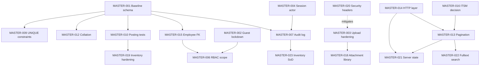

# IM One - Master Review and Implementation Roadmap

Consolidated from three independent reviews. No new review was performed; findings were merged, validated against code where necessary, and re-prioritized.

Reviewer codes used throughout:

- R1 = Architecture / Code Quality review ([Devil's advocate code review](a02cb576-bfa9-4238-94ae-c3d291dc614c))
- R2 = Database & System Flow review ([Database architecture review](77a19c20-f973-4b45-8636-ef80cb66c1c9))
- R3 = Security review ([Security devil's advocate review](6f70014f-8845-444b-b035-ead4b05bf998))

Findings marked "verified" were re-checked directly against the codebase during consolidation.

---

## 1. Master Findings

### MASTER-001 - Core database schema is not in version control

- Title: Baseline schema absent from `db/migrations`; migration numbering has collisions
- Category: Database / Release engineering
- Detected by: R2 only
- Root cause: The project adopted incremental migrations without ever committing the originating DDL. Migration `001_add_deleted_at.sql` alters `mes_data`, a table that no `CREATE TABLE` in the repo creates.
- Affected modules: All. `users`, `system_users`, `roles`, `permissions`, `employee_organization`, `divisions`, `itsm_requests`, `shift_*`, `attendance_*`, `safety_*`, `mes_*`
- Severity: CRITICAL
- Priority: P0
- Evidence (verified): [db/migrations](db/migrations) contains 001-035 with no baseline. Numbering also collides: two `003_`, two `004_`, two `005_`, two `006_` files, and `030_` is missing entirely.
- Recommended action: Commit `000_baseline.sql` from `mysqldump --no-data` of production, including every PK, FK, index, and table collation. Then reconcile duplicate migration numbers and document the runner's ordering guarantee.
- Dependencies: None. This is the root blocker - MASTER-009, MASTER-012, MASTER-015 and parts of MASTER-017 cannot be verified or safely executed without it.
- Implementation complexity: Low (dump and commit); Medium to verify it matches production exactly
- Risk of change: Very low - additive, no runtime behavior change
- Fix now: YES

### MASTER-002 - Guest mode grants unauthenticated read access to PII and all attachments

- Title: `GUEST_PERMISSIONS` makes the read surface public
- Category: Security / Authorization
- Detected by: R1 (CRITICAL) and R3 (CRITICAL) - independent agreement
- Root cause: Authorization defaults to allow-for-guest. `accountHasPermission` falls back to a static allowlist when there is no session, and that allowlist was populated with production read permissions rather than a minimal public subset.
- Affected modules: Organization (employees, attendance, shift), ITSM (read + export), Safety, Report, Training, Sparepart, Daily Operation
- Severity: CRITICAL
- Priority: P0
- Evidence (verified): [src/lib/auth/access.ts](src/lib/auth/access.ts) lines 85-107 grant guests `organizationEmployeeRead`, `organizationAttendanceRead`, `itsmRequestRead`, `itsmRequestExport`, `dailyRecordExport`, `safetySubmissionRead`, `reportLineRead`, `sparepartDocumentRead`. Because the file routes gate on `safetySubmissionRead` / `reportLineRead`, guests can also download every safety and report attachment.
- Recommended action: Default-deny. Reduce the guest allowlist to non-identifying overview permissions only (`*OverviewView`), and put guest mode behind a deployment env flag so it can be disabled entirely outside the LAN.
- Dependencies: None. Independent of MASTER-006 (scope), though both must land before the app is externally reachable.
- Implementation complexity: Low - one constant plus an env gate
- Risk of change: Medium - any screen currently relying on guest reads will start returning 401; needs a UI pass
- Fix now: YES

### MASTER-003 - Unvalidated file upload plus inline SVG serving (stored XSS)

- Title: Safety and Training accept any file type; Safety serves it back inline as `image/svg+xml`
- Category: Security / File handling
- Detected by: R3 only. R1 examined the same routes and concluded file serving was correct - see Conflicting Findings.
- Root cause: File-type policy was implemented once (Report) and never generalized. Safety and Training upload paths take the extension from the client filename and write the bytes, and the Safety serve route maps extensions to script-capable MIME types with `Content-Disposition: inline`.
- Affected modules: Safety, Training (upload); Safety (serve)
- Severity: CRITICAL
- Priority: P0
- Evidence (verified): [src/app/api/safety/files/[...path]/route.ts](src/app/api/safety/files/[...path]/route.ts) line 19 returns `image/svg+xml` and line 66 sets `inline`. [src/app/api/safety/weekly/route.ts](src/app/api/safety/weekly/route.ts) writes uploads with only `sanitizeFileName` + `getExtension`, no allowlist. [src/lib/safety/files.ts](src/lib/safety/files.ts) lines 33 and 63 explicitly treat `.svg` as a previewable image. Contrast [src/lib/report/attachmentAccept.ts](src/lib/report/attachmentAccept.ts), which does enforce an allowlist.
- Recommended action: (a) Extension + MIME allowlist on Safety and Training, explicitly excluding `svg`, `html`, `htm`, `xml`; (b) validate magic bytes, not filenames; (c) serve all user-supplied files as `Content-Disposition: attachment` with `X-Content-Type-Options: nosniff`; (d) enforce a per-file size cap below the current 100 MB and a per-submission quota.
- Dependencies: Should be implemented inside the shared attachment helper from MASTER-018 to avoid a fourth divergent copy. MASTER-020 (CSP) is defense-in-depth, not a substitute.
- Implementation complexity: Low-Medium
- Risk of change: Low - existing legitimate attachments keep working; inline preview of images needs a decision (proxy-render or download-only)
- Fix now: YES

### MASTER-004 - Actor identity is taken from the request body, not the session

- Title: Leave approval accepts `approvedBy` from the client; self-approval is permitted
- Category: Security / Workflow integrity / Audit
- Detected by: R2 (HIGH, framed as approval/execution separation) and R3 (HIGH, framed as approval forgery) - same defect
- Root cause: The API contract was designed around the frontend supplying identity from `/api/auth/me`, so the server validates the *claimed* approver against the manager chain but never against the authenticated principal (`gate.account`).
- Affected modules: Attendance (leave approval), and the same pattern for `created_by` on leave creation
- Severity: HIGH
- Priority: P0
- Evidence (verified): [src/app/api/organization/attendance/leave/route.ts](src/app/api/organization/attendance/leave/route.ts) - the route comment at lines 586-596 states "The client must provide the manager employee number in approvedBy"; line 618 reads it from the body; line 873 looks up the approver by that string; line 955 writes it to `approved_by`. `gate.account` is never compared. `isSelfApproval` is an explicitly allowed branch.
- Recommended action: Derive the approver from the session only. Reject when the session principal is not the requester's direct manager. Remove the self-approval branch. Apply the same rule to `created_by` and to any future approval workflow.
- Dependencies: Feeds MASTER-007 - an audit log is worthless while the recorded actor is client-supplied. Fix this first.
- Implementation complexity: Low (server); Low-Medium (frontend stops sending the field)
- Risk of change: Medium - will block approvals by non-manager staff who currently do this legitimately; confirm the intended operating model before shipping
- Fix now: YES

### MASTER-005 - Session transport and lifecycle are insecure by default

- Title: `Secure` cookie off by default, logout does not revoke, weak minimum `AUTH_SECRET`
- Category: Security / Authentication
- Detected by: R3 only
- Root cause: The deployment target was assumed to be a trusted HTTP LAN, and the session token was designed stateless (HMAC + expiry + `session_version`) with no per-session revocation record.
- Affected modules: All (auth layer)
- Severity: HIGH
- Priority: P0 for TLS/Secure; P1 for revocation
- Evidence (verified): [src/lib/auth/session.ts](src/lib/auth/session.ts) lines 19-23 default `Secure` to off; line 11 accepts a 16-character `AUTH_SECRET`; line 7 sets a 7-day lifetime. [src/app/api/auth/logout/route.ts](src/app/api/auth/logout/route.ts) only clears the cookie - a captured token stays valid until expiry.
- Recommended action: Serve over HTTPS and force `Secure` + HSTS in production. Raise the `AUTH_SECRET` minimum to 32 characters. Add a server-side session record (jti) checked per request so logout truly revokes, or at minimum shorten the lifetime and expose "log out everywhere" via a `session_version` bump.
- Dependencies: TLS is infrastructure work; the code changes are independent. Shares the `session_version` mechanism with MASTER-011.
- Implementation complexity: Low (flags) / Medium (session store)
- Risk of change: Low, but forcing `Secure` before TLS is in place will lock everyone out - sequence carefully
- Fix now: YES for TLS and secret length; LATER for the session store

### MASTER-006 - RBAC has no data-scope dimension

- Title: Permissions are global actions; no department or ownership filter anywhere
- Category: Security / Authorization architecture
- Detected by: R3 (HIGH). R1 assessed the same model as "coherent" - see Conflicting Findings.
- Root cause: The permission model was designed on a MODULE.RESOURCE.ACTION axis only. There is no SCOPE axis, and no route filters rows by the caller's department or ownership.
- Affected modules: Organization (employees, attendance), Sparepart, Safety, ITSM, Report
- Severity: HIGH
- Priority: P1
- Evidence: R3 traced `PUT /api/organization/employees/[id]` and `GET /api/organization/attendance/daily?employeeNo=...` - both succeed for any holder of the module permission regardless of department. R3 separately confirmed that all 101 route files do have a permission gate, so this is a scope gap, not a missing-auth gap.
- Recommended action: Add a scope qualifier (`OWN_DEPARTMENT` vs `ALL_DEPARTMENTS`) to the permission model and enforce it in the query layer for attendance, employees, safety and sparepart. Start with mutating `[id]` routes.
- Dependencies: MASTER-015 (canonical employee key + FKs) makes scope filters materially simpler and safer to write. Do 015 first or accept join-heavy filters.
- Implementation complexity: High - touches the permission catalog, seeding, UI, and every scoped query
- Risk of change: High - mis-scoping locks legitimate users out of their own data
- Fix now: LATER (after MASTER-002, which caps the immediate blast radius)

### MASTER-007 - No audit log infrastructure

- Title: Privileged actions leave no who/what/when/where/before/after record
- Category: Security / Compliance / Data model
- Detected by: R2 (inconsistent audit columns, untrusted actors) and R3 (no security audit log) - merged, same root cause
- Root cause: Auditing was implemented ad hoc per module (`created_by` on sparepart docs, `report_line_revisions`) rather than as a cross-cutting facility, so modules added later simply omitted it.
- Affected modules: Auth, Settings/Accounts, RBAC, Organization, Safety, Training, Report (reopen), Sparepart (reversal)
- Severity: HIGH
- Priority: P1
- Evidence: R3 found no audit table and no writes for `LOGIN`, `FAILED_LOGIN`, `PERMISSION_CHANGE`, `PASSWORD_RESET`, `ACCOUNT_DISABLE`, `DOCUMENT_REVERSE`, `LEAVE_APPROVE`, `REPORT_REOPEN`. R2 independently found `safety_submissions` and `training_sessions` carry no `created_by`/`updated_by` at all.
- Recommended action: One append-only `audit_log` table (actor system_user_id, action, target type/id, before/after JSON, IP, timestamp) written from a shared helper. Sequence: auth events, then RBAC/account mutations, then approvals, inventory reversals, and report reopen. Separately standardize `created_by_system_user_id` + `created_at` on operational tables, always populated from the session.
- Dependencies: MASTER-004 must land first, otherwise the log records a client-supplied actor. MASTER-001 needed before adding columns to untracked tables.
- Implementation complexity: Medium
- Risk of change: Low - additive
- Fix now: LATER (immediately after MASTER-004)

### MASTER-008 - Transaction discipline is not applied outside the inventory module

- Title: Shift generation runs dozens of writes with no transaction; report line save checks state outside its transaction
- Category: Data integrity / Architecture
- Detected by: R2 (shift generation, HIGH) and R1 (report TOCTOU, HIGH) - merged: different symptoms, one root cause
- Root cause: `withTransaction` exists and is used correctly in `lib/sparepart/posting.ts`, but that discipline was never codified as a project rule, so later multi-write workflows were written as sequential `execute()` calls.
- Affected modules: Organization/Shift Management, Report
- Severity: HIGH
- Priority: P1
- Evidence (verified): [src/app/api/organization/shift-management/generate/route.ts](src/app/api/organization/shift-management/generate/route.ts) contains no `withTransaction` call at all - it deletes a month of `shift_schedule_changes`, then loops per employee per day inserting into `shift_schedules`, then loops again inserting change rows. The same file resolves the session via an HTTP `fetch` to its own `/api/auth/me` at lines 80-85, which is fragile and adds latency inside the request. In [src/lib/report/weekReportStore.ts](src/lib/report/weekReportStore.ts), `getSubmissionStatus` and `loadReportLines` run on separate pooled connections before `withTransaction` at line 144, so the "submitted is immutable" guard is a TOCTOU.
- Recommended action: Wrap shift generation in a single transaction and batch the inserts. Move the report submission status check and line snapshot inside the transaction with `SELECT ... FOR UPDATE` on the submission row. Replace the self-`fetch` with a direct server-side session read. Then codify "multi-write workflows use `withTransaction`" as a project rule.
- Dependencies: None
- Implementation complexity: Low-Medium
- Risk of change: Medium for shift generation - long transactions hold locks; batching must be tuned
- Fix now: YES for shift generation; LATER for the report TOCTOU unless concurrent editing of the same week/area is realistic

### MASTER-009 - Business uniqueness is enforced in application code, not the database

- Title: Safety weekly check-then-insert race; `report_lines` uniqueness defeated by NULL `sub_item_id`
- Category: Data integrity
- Detected by: R2 only
- Root cause: Natural business keys were guarded with a `SELECT ... LIMIT 1` branch in the handler instead of a DB-level UNIQUE constraint.
- Affected modules: Safety, Report
- Severity: HIGH
- Priority: P1
- Evidence: R2 traced `POST /api/safety/weekly` performing a select-then-branch insert/update with no transaction and no visible unique key on `(year, month, period_type, week, activity_type)`. For Report, `uk_report_lines_week_area_subitem` includes a nullable `sub_item_id`, and MySQL does not collide NULLs, so free-form lines can duplicate.
- Recommended action: Add UNIQUE keys on the natural tuples and switch to `INSERT ... ON DUPLICATE KEY UPDATE` (the pattern already used correctly in attendance sync and stock balances). For report lines, make `sub_item_id NOT NULL` with an explicit "Other" row, or add a non-null discriminator column.
- Dependencies: MASTER-001 - the safety constraint may already exist in the untracked baseline. Verify before adding.
- Implementation complexity: Low (safety) / Medium (report lines, needs backfill)
- Risk of change: Medium - adding a UNIQUE to a table with existing duplicates fails; requires a dedupe pass
- Fix now: YES (after MASTER-001 confirms current state)

### MASTER-010 - The inventory posting engine has no automated tests

- Title: The most concurrency-sensitive and business-critical code in the app is untested
- Category: Testability / Quality assurance
- Detected by: R1 only
- Root cause: Tests were written for the easy pure functions (validation, import, mappers) and skipped for the code requiring a DB harness.
- Affected modules: Sparepart
- Severity: HIGH
- Priority: P1
- Evidence: [src/lib/sparepart/posting.ts](src/lib/sparepart/posting.ts) is roughly 584 lines covering balance mutation, negative-stock guards, doc-number sequencing under `FOR UPDATE`, and reversal reconstruction. Test files exist for `sparepart/validation` and `sparepart/import` but there is no `posting.test.ts`.
- Recommended action: Integration tests against a transactional test schema covering: 101/201/311 happy paths, insufficient-stock rejection, idempotent replay via `client_request_id`, double-reversal rejection, and a 311/312 round trip returning balances to origin.
- Dependencies: MASTER-001 makes a reproducible test schema possible. Should land before MASTER-019 touches this file.
- Implementation complexity: Medium - needs test DB tooling that does not exist yet
- Risk of change: None - additive
- Fix now: YES

### MASTER-011 - Process-local auth state causes stale permissions and a shared rate-limit bucket

- Title: In-memory permission cache is not invalidated on role edits; login rate limiter collapses to one bucket
- Category: Security / Scalability
- Detected by: R1 (HIGH, cache staleness and multi-instance) and R3 (LOW for cache, plus the rate-limiter DoS) - merged, same root cause
- Root cause: Both caches are module-level `Map`s in the Node process, and the permission cache key (`systemUserId:sessionVersion`) does not change when a *role's* permissions are edited - only password changes bump `session_version`.
- Affected modules: Auth
- Severity: HIGH (correctness of revocation), MEDIUM in today's single-instance deployment
- Priority: P1
- Evidence: [src/lib/auth/accounts.ts](src/lib/auth/accounts.ts) - `permissionsCache` at module scope with a 30s TTL. R3 additionally found that in [src/lib/auth/loginRateLimit.ts](src/lib/auth/loginRateLimit.ts), `clientIp()` returns the literal `"direct"` when `TRUST_PROXY` is unset, so all clients share one IP bucket and 30 total failures across the whole user base can lock out every login.
- Recommended action: Bump `session_version` for all affected accounts when a role's permissions change - this invalidates the cache key immediately and is a small change. Fix the `clientIp` fallback so an unconfigured proxy does not collapse buckets, and add per-account lockout. Move both caches to a shared store before running more than one instance.
- Dependencies: Shares the `session_version` mechanism with MASTER-005.
- Implementation complexity: Low (session_version bump, IP fallback); Medium (shared store)
- Risk of change: Low
- Fix now: YES for the `session_version` bump and the rate-limiter bucket; LATER for the shared store

### MASTER-012 - Mixed collations across modules

- Title: `utf8mb4_general_ci` and `utf8mb4_unicode_ci` coexist, breaking cross-module text joins
- Category: Database
- Detected by: R2 only
- Root cause: Later modules (report, training, safety) were created with a different default collation than the core and sparepart tables.
- Affected modules: Report, Training, Safety vs core/Sparepart
- Severity: HIGH (latent - fails at runtime the first time a cross-module text join is written)
- Priority: P1
- Evidence: R2 compared migration DDL: sparepart and core tables use `utf8mb4_general_ci`; `022_training_module.sql`, `024_report_module.sql` and the safety tables use `utf8mb4_unicode_ci`. Joining, for example, `training_session_participants.participant_name_en` to `users.name_en` raises "Illegal mix of collations".
- Recommended action: Standardize on one collation database-wide and convert tables, watching index key lengths.
- Dependencies: MASTER-001 - the full current state is unknowable without the baseline.
- Implementation complexity: Medium
- Risk of change: Medium - table conversions on large tables need a maintenance window
- Fix now: LATER (but before any cross-module KPI join is built)

### MASTER-013 - No server-side pagination on any list endpoint

- Title: List APIs return entire result sets; ITSM silently truncates at 5,000 rows
- Category: Performance / Scalability / API design
- Detected by: R1 only
- Root cause: The first list endpoint returned everything and each subsequent module copied it. There is no shared list-query helper.
- Affected modules: ITSM, Sparepart, Daily Operation, Training, and every `*Client.tsx` that paginates in the browser
- Severity: HIGH
- Priority: P1
- Evidence: R1 traced [src/app/api/itsm/itsm-request/route.ts](src/app/api/itsm/itsm-request/route.ts) hard-capping at 5000 with no total count (rows past the cap are dropped with no error), [src/app/api/sparepart/documents/route.ts](src/app/api/sparepart/documents/route.ts) returning all documents with a full `GROUP BY`, and [src/app/itsm/management/ManagementClient.tsx](src/app/itsm/management/ManagementClient.tsx) slicing the array in the browser.
- Recommended action: Define one pagination contract (`page`/`pageSize` or keyset `cursor`) returning `{ rows, total, nextCursor }` in a shared `lib/http/list.ts`. Apply to all new routes immediately; retrofit ITSM first because it silently loses data.
- Dependencies: Build on the shared HTTP layer from MASTER-014. Pairs with MASTER-022 (search indexing) - do them in one pass per endpoint.
- Implementation complexity: Medium - API contract plus every consuming screen
- Risk of change: Medium-High - breaking change for clients; retrofit endpoint by endpoint
- Fix now: YES for the shared contract and ITSM; LATER for low-volume modules

### MASTER-014 - No shared HTTP contract layer

- Title: Two competing response envelopes, hardcoded mixed-language error strings, and raw `error.message` leakage
- Category: API design / Maintainability / Security (minor)
- Detected by: R1 (envelopes, i18n) and R3 (error message leakage) - merged, same root cause
- Root cause: Each module defined its own `apiHelpers`, so there is no single `json()`/`jsonError()` that all routes go through.
- Affected modules: All API routes
- Severity: MEDIUM
- Priority: P2
- Evidence: R1 found `{ rows }` in ITSM/sparepart/mes-record versus `{ success, data }` / `{ success: false, error }` in report and training, with [src/lib/apiClient.ts](src/lib/apiClient.ts) only reading `.error`/`.rows`. Validation strings mix Indonesian ("Year tidak valid.", "Month harus antara 1 sampai 12." in [src/lib/safety/apiHelpers.ts](src/lib/safety/apiHelpers.ts)) with English elsewhere. R3 separately found routes echoing `error.message` to the client.
- Recommended action: Pick one envelope and one `lib/http/` module exposing `json()`, `jsonError()` (generic message + server-side log, never `error.message`), and stable machine error codes the client localizes. Enforce for all new routes; migrate opportunistically.
- Dependencies: Prerequisite for MASTER-013 (pagination lives in the same module).
- Implementation complexity: Low to introduce; Medium to migrate 101 routes
- Risk of change: Medium during migration - client and server must move together per route
- Fix now: LATER, but decide the standard now

### MASTER-015 - Employee identity is fragmented across three keys with no foreign keys

- Title: `users.id`, `users.employee_no` and `employee_organization.id` all denote "an employee"
- Category: Database / Entity design
- Detected by: R2 only
- Root cause: `employee_no` (a natural key) was embedded directly as a string in the highest-volume tables instead of a surrogate FK, and `employee_organization` introduced a third identity for the employment record.
- Affected modules: Organization (shift, attendance, leave)
- Severity: HIGH
- Priority: P2
- Evidence: R2 found `shift_schedules.employee_no`, `shift_schedule_changes.employee_no`, `attendance_daily.employee_no` and `attendance_leave_requests.employee_no` are non-FK strings. Every schedule/attendance query becomes a triple join, and an `employee_no` correction silently orphans an entire schedule history.
- Recommended action: Make `users.id` the canonical FK on schedule and attendance tables, keep `employee_no` as a display cache only, and enforce with real foreign keys.
- Dependencies: MASTER-001 required first. Strongly enables MASTER-006 (scope filters).
- Implementation complexity: Medium - backfill plus FK creation on the largest tables
- Risk of change: High - touches every attendance and shift query
- Fix now: LATER

### MASTER-016 - ITSM is a read-only import mirror presented as a workflow module

- Title: `itsm_requests` is a flat external export with free-string status and text dates
- Category: Architecture / Governance
- Detected by: R2 only
- Root cause: The table was created by importing a spreadsheet from an external ticketing tool; a surrogate `id` and parsed datetime columns were retrofitted later, but no lifecycle model was ever built.
- Affected modules: ITSM
- Severity: HIGH (as a governance risk, not a current defect)
- Priority: P2
- Evidence: R2 found `status`, `group_name` and `technician` are free strings with no FK to `users`; `created_date`/`due_by_date` are text in `%d/%m/%Y %h:%i %p`; `032_itsm_requests_index.sql` added the surrogate key, deduped `request_id`, and added parallel parsed DATETIME columns. `is_service_request` holds a mix of `1`, `'1'`, `'true'`, `'yes'`, `'y'`.
- Recommended action: Decide explicitly and document it. If ITSM stays read-only, freeze the table as an import/staging area and forbid application writes - the re-import dedupe (`DELETE t1 JOIN t2 ON request_id`) will silently destroy any in-app edits. If in-app ticketing is wanted, model it properly with `tickets`, `ticket_assignments`, `ticket_status_history`.
- Dependencies: None, but the decision gates any future ITSM feature work
- Implementation complexity: Low to freeze and document; High to build a real ticket model
- Risk of change: Low for the documentation path
- Fix now: LATER (decision needed now, code change later)

### MASTER-017 - Attendance has no actual capture; the derived table silently overwrites corrections

- Title: `attendance_daily` is planned roster plus leave register, not attendance
- Category: Data model / Semantics
- Detected by: R2 only
- Root cause: The module was built from the shift roster outward, so `planned_hours` was treated as attendance and no clock-event capture was ever modeled.
- Affected modules: Organization (attendance), Dashboard/KPI
- Severity: HIGH (semantic - KPIs mean something other than what they are labelled)
- Priority: P2
- Evidence: R2 found no check-in/check-out timestamps anywhere; exceptions are entered as a leave-request type `NO_ATTENDANCE`. `/attendance/daily/sync` recomputes every employee-day from `shift_schedules` plus leave and writes via `ON DUPLICATE KEY UPDATE`, with no "manually edited" flag - so any correction is reverted on the next sync with no trace.
- Recommended action: Decide whether actual attendance is a requirement. If yes, add an `attendance_events` capture path and compute `attendance_daily` from actuals versus schedule. If no, rename the concept to roster/leave so nobody misreads the KPI, and add an `is_manual_override` flag that sync respects.
- Dependencies: MASTER-001 (the `attendance_daily` DDL and its unique key are untracked)
- Implementation complexity: Low (flag and rename) to High (real capture)
- Risk of change: Low for the flag; High for a new capture path
- Fix now: LATER (product decision required)

### MASTER-018 - Attachment handling is implemented three different ways

- Title: Training uses inline columns, Safety uses inline plus a child table, Report uses a child table - with duplicated upload/MIME code
- Category: Architecture / Data model
- Detected by: R2 (three schema patterns, duplicated Safety storage) and R1 (`contentTypeFromName` duplicated) - merged, same root cause
- Root cause: Each module implemented attachments independently; no shared attachment library or schema convention exists.
- Affected modules: Safety, Training, Report, Sparepart (images)
- Severity: MEDIUM
- Priority: P2
- Evidence (verified): `contentTypeFromName` is duplicated in [src/app/api/safety/files/[...path]/route.ts](src/app/api/safety/files/[...path]/route.ts) and [src/lib/report/upload.ts](src/lib/report/upload.ts). R2 found `safety_submissions` stores the first file in inline `file_name`/`file_url` columns *and* in `safety_submission_files`, requiring manual sync; `training_sessions` uses five inline columns limiting it to one attachment.
- Recommended action: Keep per-module child tables with real FKs (do not build a polymorphic `attachments(entity_type, entity_id)` table - both R2 and this consolidation agree it would destroy referential integrity). Standardize the *code* into one `lib/attachments` handling validation, storage, MIME and serving. Convert Training to a child table and drop Safety's inline file columns.
- Dependencies: MASTER-003 should be implemented inside this shared helper. Note that [src/lib/sparepart/images.ts](src/lib/sparepart/images.ts) is already the correct model (extension + MIME check, 1 MB cap, strict filename regex, resolved-path containment) - use it as the template.
- Implementation complexity: Medium
- Risk of change: Medium - schema migration for existing attachments
- Fix now: LATER (but MASTER-003 forces the helper to exist, so scope it accordingly)

### MASTER-019 - Inventory hardening (doc-number race, zero-balance deletion, unconstrained movement type)

- Title: Residual weak spots in an otherwise correct posting engine
- Category: Data integrity / Performance
- Detected by: R2 (doc-number race, zero-balance delete, `movement_type` VARCHAR) and R1 (redundant `syncItemStockCurrent`) - merged, one hardening pass on one file
- Root cause: The module is well built; these are the edges that were not covered.
- Affected modules: Sparepart
- Severity: MEDIUM
- Priority: P2
- Evidence: R2 found `nextDocNumber()` does `SELECT ... LIKE 'MD<date>%' ORDER BY doc_number DESC LIMIT 1 FOR UPDATE`; for the first document of a day the range matches zero rows, so correctness depends on the server's isolation level (gap locking under REPEATABLE READ saves it; READ COMMITTED does not) and there is no retry. `adjustBalance` DELETEs the balance row at zero, losing the fact that an item was ever stocked at a location. `movement_type VARCHAR(8)` has no CHECK. R1 and R2 both noted `syncItemStockCurrent` is recomputed once per line inside the posting loop.
- Recommended action: Replace doc-number generation with a dedicated counter row (guaranteed present, `FOR UPDATE`) or add retry-on-duplicate, and pin the required isolation level. Keep balance rows at qty 0 and filter zeros in reads. Add a CHECK or ENUM on `movement_type`. Collect affected item ids and recompute `stock_current` once after the loop.
- Dependencies: MASTER-010 (tests) should land first - this file is the one place where a regression corrupts stock silently.
- Implementation complexity: Low-Medium
- Risk of change: Medium - this is the highest-consequence file in the codebase
- Fix now: LATER (after tests exist)

### MASTER-020 - No security headers and no CSRF defense-in-depth

- Title: `next.config.ts` sets no `headers()`; there is no middleware
- Category: Security configuration
- Detected by: R3 only
- Root cause: Security headers were never configured; SameSite=Lax was treated as sufficient CSRF protection.
- Affected modules: Application-wide
- Severity: MEDIUM
- Priority: P2
- Evidence: R3 confirmed [next.config.ts](next.config.ts) defines redirects only and no `middleware.ts` exists. Missing CSP (including `frame-ancestors`), HSTS, `X-Content-Type-Options: nosniff`, `Referrer-Policy`. CORS is unconfigured, so same-origin default applies - that part is fine.
- Recommended action: Add a `headers()` block with CSP, HSTS, `nosniff`, `frame-ancestors 'none'` and `Referrer-Policy`. Add `Origin`/`Referer` validation on state-changing routes as defense-in-depth.
- Dependencies: `nosniff` materially reduces the impact of MASTER-003 but is not a substitute for it.
- Implementation complexity: Low
- Risk of change: Medium - a strict CSP will break inline styles/scripts; needs iteration in staging
- Fix now: LATER (soon after MASTER-003)

### MASTER-021 - No shared server-state layer on the frontend

- Title: Manual `loading`/`error`/`data` fetch logic duplicated across roughly 17 client components
- Category: Frontend architecture / Maintainability
- Detected by: R1 only
- Root cause: No data-fetching library was adopted, and `apiClient` uses `cache: "no-store"`, so nothing is cached or deduped.
- Affected modules: All `*Client.tsx` screens
- Severity: MEDIUM
- Priority: P2
- Evidence: R1 identified [src/app/itsm/management/ManagementClient.tsx](src/app/itsm/management/ManagementClient.tsx) lines 37-68 as representative, with the pattern repeated across every client component, and `cache: "no-store"` at [src/lib/apiClient.ts](src/lib/apiClient.ts) line 110.
- Recommended action: Adopt TanStack Query or SWR with a thin wrapper around the existing `apiClient`. High leverage given the stated "new module every month" trajectory.
- Dependencies: Best sequenced after MASTER-014 so the wrapper is written against the final envelope, and before MASTER-013's retrofit so pagination state is managed by the library.
- Implementation complexity: Medium - incremental, screen by screen
- Risk of change: Low if adopted incrementally
- Fix now: LATER, but before the next few modules land

### MASTER-022 - Non-sargable `LIKE '%term%'` search on unindexed text columns

- Title: Every search box triggers a full table scan
- Category: Performance
- Detected by: R1 only
- Root cause: Search was implemented with leading-wildcard `LIKE` and no full-text index.
- Affected modules: ITSM, Daily Operation
- Severity: MEDIUM
- Priority: P3
- Evidence: R1 traced leading-wildcard `LIKE` on `request_id`, `subject`, `requester`, `technician` in the ITSM route and equivalents in `mes-record`. Compounded by MASTER-013 since the full result set is then returned.
- Recommended action: Add FULLTEXT indexes (or a dedicated search column) for searchable fields. Do it in the same pass as pagination per endpoint.
- Dependencies: MASTER-013
- Implementation complexity: Low-Medium
- Risk of change: Low
- Fix now: LATER

### MASTER-023 - No segregation of duties on inventory movements

- Title: A single user with post and reverse permissions can fabricate and unwind stock movements
- Category: Security / Insider abuse
- Detected by: R3 only
- Root cause: The inventory module was designed for correctness under concurrency, not for dual control.
- Affected modules: Sparepart
- Severity: MEDIUM
- Priority: P3
- Evidence: R3 confirmed postings and reversals correctly attribute `created_by` from the session (good), but there is no approval step and no threshold above which a second party is required.
- Recommended action: Require a second approver for adjustments and reversals above a configurable threshold; alert on reversal spikes. Depends on having an audit log to detect abuse in the first place.
- Dependencies: MASTER-007
- Implementation complexity: Medium
- Risk of change: Medium - adds friction to a currently one-step operation
- Fix now: LATER

### MASTER-024 - Safety schema debt: duplicated bilingual columns and a dead status column

- Title: `description`/`description_en`/`description_cn` and `pic`/`pic_en`/`pic_cn` must be hand-synced; `status` is always `completed`
- Category: Database / Cleanup
- Detected by: R2 only
- Root cause: Bilingual columns were added alongside the originals without retiring the originals.
- Affected modules: Safety
- Severity: LOW
- Priority: P3
- Evidence: R2 found the POST handler literally does `const description = descriptionEn;`, writing the same value twice - an update anomaly by construction.
- Recommended action: Migrate readers to the `_en`/`_cn` pair and drop the legacy singletons, mirroring how `sparepart_items.name` was retired in favor of `name_en`/`name_cn`. Drop or give meaning to `status`.
- Dependencies: MASTER-001
- Implementation complexity: Low
- Risk of change: Low
- Fix now: NO

### MASTER-025 - Shift rotation rules are mutated in place with no versioning

- Title: Editing an active rule makes `rotation_rule_id` on historical rows misleading
- Category: Data model / Auditability
- Detected by: R2 only
- Root cause: Only one active rotation rule exists and it is edited rather than superseded.
- Affected modules: Organization (shift)
- Severity: MEDIUM
- Priority: P3
- Evidence: R2 confirmed generated `shift_schedules` rows correctly snapshot `schedule_type`/`shift_code` (good), but they also carry `rotation_rule_id` pointing at a rule whose parameters may since have changed - so "why was this month generated this way" becomes unanswerable.
- Recommended action: Version rotation rules - insert a new row on change, never mutate an active rule's parameters.
- Dependencies: MASTER-001
- Implementation complexity: Medium
- Risk of change: Low
- Fix now: NO

### MASTER-026 - Master-data deletes cascade into historical rows

- Title: `ON DELETE CASCADE` from report areas and sub-items into historical report data
- Category: Database
- Detected by: R2 only
- Root cause: Cascade was applied uniformly instead of distinguishing master data from transactional history.
- Affected modules: Report
- Severity: LOW
- Priority: P3
- Evidence: R2 found `report_sub_items -> report_areas ON DELETE CASCADE` and the same on `report_category_templates`. Deleting a master area cascades away historical structured line linkage.
- Recommended action: Switch master deletes to `RESTRICT` and rely on the `is_active` flags that already exist on most masters.
- Dependencies: MASTER-001
- Implementation complexity: Low
- Risk of change: Low
- Fix now: NO

### MASTER-027 - Blocking outbound notification inside the create path

- Title: WeCom notification is awaited before the POST response returns
- Category: Performance
- Detected by: R1 only
- Root cause: The notification was added inline rather than queued.
- Affected modules: Daily Operation
- Severity: LOW
- Priority: P3
- Evidence: R1 found [src/app/api/daily-operation/mes-record/route.ts](src/app/api/daily-operation/mes-record/route.ts) performs an extra detail `SELECT` then awaits `notifyMesRecordCreated` before responding. It is `try`/`catch`-wrapped so failure does not break the write (good), but a slow WeCom endpoint adds its full timeout to every record creation.
- Recommended action: Do not await it, or enqueue it. Ensure the outbound call has a tight timeout.
- Dependencies: None
- Implementation complexity: Low
- Risk of change: Low
- Fix now: NO

### MASTER-028 - Permission gating is a copy-paste ritual rather than structural

- Title: `requirePermission` boilerplate repeated across roughly 101 routes
- Category: Maintainability / Security hygiene
- Detected by: R1 (LOW). R3 independently verified that no route currently omits the gate.
- Root cause: There is no route wrapper, so protection depends on every author remembering the same three lines.
- Affected modules: All API routes
- Severity: LOW (preventive - there is no current gap)
- Priority: P3
- Evidence: R1 found the pattern `const gate = await requirePermission(...); if (gate instanceof NextResponse) return gate;` in every route file. R3's audit of all 101 route files found no missing gate, which confirms this is a future-omission risk rather than a present defect.
- Recommended action: A `withPermission(code, handler)` wrapper so protection is structural. Note that the absence of a Next.js `middleware.ts` is a deliberate, defensible choice given per-route permission granularity - do not replace this with middleware.
- Dependencies: Natural companion to MASTER-014's shared HTTP layer
- Implementation complexity: Low to introduce; Medium to migrate
- Risk of change: Low
- Fix now: NO

---

## 2. Duplicate Mapping

Findings reported by more than one reviewer, merged into a single master:

- MASTER-002 (guest mode): R1 "Guest mode exposes all read data" + R3 "Unauthenticated access via Guest Mode". Identical finding, identical remediation, both rated CRITICAL.
- MASTER-004 (client-supplied actor): R2 "Leave approval - approver identity from request body" + R3 "Leave approval trusts client-supplied approver; self-approval allowed". Same defect described from a data-integrity angle and a security angle.
- MASTER-007 (audit): R2 "No consistent audit columns / actor trust" + R3 "No security audit logging" + R3 "Report reopen has no responsibility trail" + R2 "Reopen/submit events not event-logged". Four symptoms, one absent facility.
- MASTER-008 (transactions): R2 "Shift generation is not transactional" + R1 "`saveReportWeekLines` TOCTOU". Different modules, one root cause - transaction discipline was never propagated out of the inventory module.
- MASTER-011 (process-local state): R1 "In-memory permission cache not invalidated on role change" + R3 "Permission cache TTL 30s" + R3 "In-memory rate limiter, shared `direct` IP bucket". Same class of module-level in-process state.
- MASTER-014 (HTTP layer): R1 "Inconsistent response envelopes" + R1 "Hardcoded mixed-language validation messages" + R3 "Routes echo `error.message`". All three disappear with one shared `json()`/`jsonError()`.
- MASTER-018 (attachments): R2 "Three attachment patterns across modules" + R2 "Safety dual attachment storage" + R1 "`contentTypeFromName` duplicated three times". Schema and code symptoms of the same missing shared library.
- MASTER-019 (inventory hardening): R2 "doc-number race" + R2 "zero-balance deletion" + R2 "`movement_type` VARCHAR" + R1 and R2 both "`syncItemStockCurrent` per line". One hardening pass on one file.

All three reviewers independently praised the same things: the sparepart posting engine (transaction + `FOR UPDATE` + idempotency + immutable reversals), parameterized SQL with no injection found, path-traversal-safe file resolution, and the clean `app/api -> lib/<module> -> db` layering. Those are recorded as constraints on the roadmap, not findings.

---

## 3. False Positives and Downgrades

- Not a finding - "duplicate file paths in glob output" (R1): self-identified as a tool artifact from mixed path separators. Discarded.
- Not a finding - "missing auth on API routes": neither reviewer found an ungated route. R3 explicitly verified all 101 route files carry a gate. MASTER-028 is retained only as preventive hygiene, downgraded to LOW.
- Not a finding - "SQL injection": R1 and R3 independently reached the same conclusion. Dynamic `WHERE` fragments are fixed strings with `?` placeholders. No action.
- Not a finding - "no CORS policy" (R3 raised, then dismissed): no custom CORS headers means same-origin default, which is correct. No action.
- Downgraded - "path traversal in file serving": R1 correctly verified this is safe (`..` and null-byte rejection, `path.resolve` confined to the upload root). R3 agreed. The file-serving problem in MASTER-003 is MIME and disposition, not traversal - do not "fix" the traversal code.
- Downgraded - "materialized views / summary tables needed": R2 explicitly recommended against introducing these now, and R1 did not raise them. Live queries against transactional tables are correct at current scale. Revisit only when a dashboard query exceeds roughly 100-200ms on real data.
- Downgraded - "microservices / rewrite": all three reviewers rejected this. The layering is the codebase's main asset.
- Unverifiable pending MASTER-001 - R2's claims that `safety_submissions` lacks a UNIQUE on its natural tuple, and that `attendance_daily` lacks indexes on `(attendance_date)` and `(employee_no, attendance_date)`, are inferences from application code, because the DDL is untracked. These may already be satisfied in production. Verify against the baseline before doing the work in MASTER-009.

---

## 4. Conflicting Findings and Resolutions

- File serving: R1 concluded "file serving is permission-gated and path-traversal safe - do not simplify it" and listed it under things that should not be changed. R3 found the same route is a stored-XSS vector. Resolution: both are correct about different properties. Traversal handling is sound and must be preserved; the MIME map and `Content-Disposition: inline` are the defect. Verified directly - line 19 returns `image/svg+xml` and line 66 sets `inline`. R3 is decisive here; MASTER-003 stands at CRITICAL.
- RBAC quality: R1 called the permission model "coherent" and recommended keeping it; R3 rated the absence of scope HIGH. Resolution: the model is well-formed on the action axis and should not be rebuilt, but it has no scope axis. R1 evaluated structure, R3 evaluated reach. Both conclusions hold - MASTER-006 adds a dimension rather than replacing the model.
- Permission cache severity: R1 rated it HIGH (multi-instance staleness plus no invalidation on role edit); R3 rated the same cache LOW (30s TTL, mitigated by `session_version` on account edit). Resolution: R1 identified the sharper issue - editing a *role's* permissions does not bump `session_version`, so revocation is delayed and inconsistent. Held at HIGH for the `session_version` fix, with the shared-store migration deferred to when a second instance is actually deployed.
- Rate limiting: R3 described it as both a working brute-force control and a self-inflicted DoS. Resolution: both are true. The per-(IP, login) limit works; the IP-level limit collapses to a single bucket when `TRUST_PROXY` is unset. Only the IP fallback needs fixing.
- Inventory quality: R1 and R2 both rated the posting engine as exemplary; R3 flagged the absence of segregation of duties. Resolution: not a contradiction. The engine is technically correct (MASTER-010 protects it with tests, MASTER-019 hardens its edges) while the surrounding process lacks dual control (MASTER-023).
- ITSM: R2 called it a critical data-model problem; R1 did not flag the model at all, only its pagination. Resolution: R2 is right that it is not a workflow model, but this is a design-intent question rather than a defect. Reclassified as governance - the actionable risk is a future write path being built on an import table that gets deduped on re-import.

---

## 5. Root Cause Summary

Twenty-eight findings collapse into six underlying causes:

1. Correct patterns exist but were never codified as rules. The sparepart module does transactions, locking, idempotency and session-derived actors correctly. Later modules did not, because nothing made the standard mandatory or discoverable. Causes MASTER-004, 007, 008, 018.
2. Security defaults were chosen for a trusted HTTP LAN. Guest reads, non-Secure cookies, no headers, no audit log, and no scope all make sense under "everyone here is trusted" and all fail the moment that assumption weakens. Causes MASTER-002, 005, 006, 007, 020.
3. Schema is not treated as source code. No baseline, colliding migration numbers, mixed collations, missing FKs and missing UNIQUE constraints all follow from the same gap. Causes MASTER-001, 009, 012, 015, 026.
4. No shared cross-cutting layer. Each module reimplements HTTP responses, list queries, error messages, attachments and fetch state. Causes MASTER-013, 014, 018, 021, 028.
5. Data models were built from the available data rather than the business concept. ITSM mirrors a spreadsheet; attendance derives from a roster; safety carries legacy plus bilingual columns. Causes MASTER-016, 017, 024.
6. Testing effort went where it was easy, not where the risk is. Pure functions are tested; the transactional posting engine is not. Causes MASTER-010.

---

## 6. Backlog by Priority

P0 - launch blockers, start immediately:

- MASTER-001 Baseline schema in version control
- MASTER-002 Lock down guest permissions
- MASTER-003 Upload allowlist plus attachment disposition
- MASTER-004 Session-derived approver, remove self-approval
- MASTER-005 TLS, Secure cookie, `AUTH_SECRET` minimum 32

P1 - next, within one or two sprints:

- MASTER-007 Audit log infrastructure
- MASTER-008 Transaction boundaries (shift generation, report save, remove self-`fetch`)
- MASTER-009 UNIQUE constraints on natural business tuples
- MASTER-010 Inventory posting integration tests
- MASTER-011 `session_version` bump on role edit; fix rate-limiter IP bucket
- MASTER-012 Standardize collation
- MASTER-013 Pagination contract plus ITSM retrofit
- MASTER-006 RBAC scope dimension (large; start design in P1, deliver in P2)

P2 - structural work, plan deliberately:

- MASTER-014 Shared HTTP contract layer
- MASTER-015 Canonical employee key and foreign keys
- MASTER-016 ITSM read-only decision and freeze
- MASTER-017 Attendance capture decision or override flag
- MASTER-018 Shared attachment library plus schema convergence
- MASTER-019 Inventory hardening
- MASTER-020 Security headers and CSRF defense-in-depth
- MASTER-021 Server-state library adoption

P3 - cleanup and deferred:

- MASTER-022 Full-text search indexes
- MASTER-023 Inventory segregation of duties
- MASTER-024 Safety legacy column removal
- MASTER-025 Rotation rule versioning
- MASTER-026 Master-data delete cascade to RESTRICT
- MASTER-027 Non-blocking WeCom notification
- MASTER-028 `withPermission` route wrapper

---

## 7. Dependency Order

Hard ordering constraints:

- MASTER-001 before any schema change. Without it you cannot confirm current constraints, and MASTER-009 and MASTER-012 are guesswork.
- MASTER-004 before MASTER-007. An audit log that records a client-supplied actor is worse than none - it manufactures false confidence.
- MASTER-010 before MASTER-019. Do not modify the posting engine without tests around it.
- MASTER-003 defines the shared attachment helper that MASTER-018 then generalizes. Do not write a fourth copy of MIME handling.
- MASTER-014 before MASTER-013. Pagination belongs in the shared HTTP module; building it standalone guarantees rework.
- MASTER-005: TLS must be in place before forcing `Secure`, or every user is locked out.

Parallelizable without conflict: MASTER-002, MASTER-003, MASTER-005 and MASTER-001 touch disjoint files and can run concurrently in the first sprint.

---

## 8. Top 10 Implementation Actions

1. Commit `000_baseline.sql` from a production `mysqldump --no-data`, and reconcile the duplicate migration numbers (003/004/005/006) and the missing 030. Unblocks five other findings and makes every subsequent database claim verifiable. (MASTER-001)
2. Reduce `GUEST_PERMISSIONS` to overview-only permissions and put guest mode behind an env flag. One constant; removes unauthenticated access to employee PII, attendance, ITSM export and every safety and report attachment. (MASTER-002)
3. Add an extension and MIME allowlist to Safety and Training uploads excluding `svg`/`html`/`xml`, and serve all user files as `attachment` with `nosniff`. Closes the stored-XSS-to-admin-takeover path. Use [src/lib/sparepart/images.ts](src/lib/sparepart/images.ts) as the template. (MASTER-003)
4. Derive the leave approver from `gate.account` instead of `body.approvedBy`, and remove the self-approval branch. Stop accepting `createdBy` from clients anywhere. (MASTER-004)
5. Put the deployment behind TLS, force `Secure` cookies plus HSTS, and raise the `AUTH_SECRET` minimum to 32 characters. Sequence TLS first. (MASTER-005)
6. Wrap `shift-management/generate` in a single `withTransaction`, batch its per-employee-per-day inserts, and replace the self-`fetch("/api/auth/me")` with a direct server-side session read. (MASTER-008)
7. Write integration tests for `lib/sparepart/posting.ts` covering 101/201/311, insufficient stock, idempotent replay via `client_request_id`, double-reversal rejection, and a 311/312 round trip. (MASTER-010)
8. Bump `session_version` for affected accounts whenever a role's permissions change, and fix `clientIp()` so an unconfigured `TRUST_PROXY` does not collapse all clients into one rate-limit bucket. Two small changes, one security-correctness and one availability. (MASTER-011)
9. Create `lib/http/` with a single response envelope, a `jsonError()` that never echoes `error.message`, and a `buildList()` pagination helper returning `{ rows, total, nextCursor }`. Mandate it for all new routes; retrofit ITSM first because its 5,000-row cap silently drops data. (MASTER-014 then MASTER-013)
10. Add the `audit_log` table and a shared write helper, starting with auth events, RBAC and account mutations, leave approvals, inventory reversals and report reopen. Do this only after action 4. (MASTER-007)

---

## Constraints on All Work

These were independently validated as correct by multiple reviewers and must be preserved:

- The `app/api/*/route.ts -> lib/<module>/{store,service}.ts -> lib/db.ts` layering and inward dependency direction. This is why the codebase can grow; codify it rather than change it.
- `lib/sparepart/posting.ts` - transaction plus `FOR UPDATE` on item, location and balance rows, negative-stock guard, `client_request_id` idempotency, immutable documents with reconstructed reversals and double-reversal prevention. Add tests, harden the edges, do not restructure.
- `lib/auth/session.ts` - HMAC-SHA256 with `timingSafeEqual`, expiry enforcement, `session_version` invalidation, `httpOnly` and `sameSite`. The gaps are transport and revocation, not the token design.
- Path-traversal defenses in the file routes (`..` and null-byte rejection, `path.resolve` confined to the upload root).
- `report_line_revisions` - JSON snapshots as an immutable audit copy rather than as the live record. Correct use of JSON; reuse this pattern.
- Parameterized queries throughout, the MySQL pool configuration, and the idempotent migration runner.
- Live dashboard queries against transactional tables. Do not add materialized views or summary tables yet.
- The absence of `middleware.ts` is a deliberate choice given per-route permission granularity. A `withPermission` wrapper is the right refinement; middleware is not.

